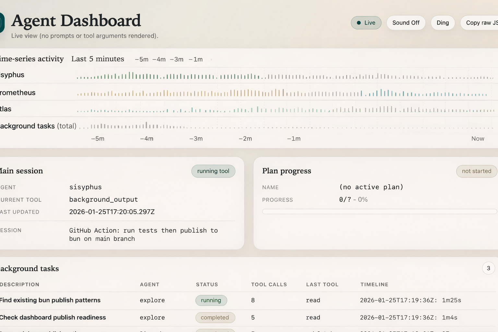

# Oh My OpenCode Dashboard

Local-only, read-only dashboard for viewing OpenCode & OhMyOpenCode agent progress.



## Goals

- Show plan progress from `.sisyphus/boulder.json` + the active plan markdown.
- Show a best-effort view of background tasks from persisted OpenCode session artifacts.
- Show main-session activity + recent tool-call activity as lightweight signals.
- Never render prompts, tool arguments, or raw tool outputs.

## What You Can See

- Main session: agent, current tool/model, session label/id, last update, status.
- Plan progress: checkbox progress + optional step list (parsed from plan markdown).
- Main session task row: a single roll-up row for the detected main session.
- Source dropdown (optional): switch between registered project sources; each source shows its active main session.
- Background tasks: best-effort inferred from `delegate_task` tool parts; expandable.
- Tool calls (metadata only): per-session tool name/status/timestamp, capped for safety.
- Token usage: totals with an expandable per-model breakdown.
- Time-series activity: last 5 minutes of tool-call counts (main agents + background total).
- Sound notifications (optional): dings when progress advances / question appears / waiting for user.
- Raw JSON (redacted): copy the API payload that the UI is rendering.

## Requirements

- Bun

## Install (npm)

Run without installing globally (from your target project directory):

```bash
bunx oh-my-opencode-dashboard@latest
```

Register additional project sources (optional; enables the source dropdown in the UI):

```bash
bunx oh-my-opencode-dashboard@latest add --name "My Project"
```

Or run the dashboard for a different project path:

```bash
bunx oh-my-opencode-dashboard@latest add --name "My Project" --project /absolute/path/to/your/project
```

Defaults:

- `--project` defaults to current working directory
- `--name` defaults to `basename(projectRoot)`

Or specify a project path explicitly:

```bash
bunx -p oh-my-opencode-dashboard oh-my-opencode-dashboard -- --project /absolute/path/to/your/project
```

Or install globally:

```bash
bun add -g oh-my-opencode-dashboard
```

Then:

```bash
oh-my-opencode-dashboard
```

Options:

- `--project <path>` (optional): project root used for plan lookup + session filtering (defaults to current working directory)
- `--port <number>` (optional): default 51234

## Install (from source)

```bash
bun install
```

## Run

Development (API + UI dev server):

```bash
bun run dev -- --project /absolute/path/to/your/project
```

Production (single server serving UI + API):

```bash
bun run build
bun run start -- --project /absolute/path/to/your/project
```

## What It Reads (File-Based)

- Project (optional; OhMyOpenCode plan tracking):
  - `.sisyphus/boulder.json`
  - Plan file at `boulder.active_plan`
- OpenCode storage:
  - `${XDG_DATA_HOME ?? ~/.local/share}/opencode/storage/{session,message,part}`

## How It Chooses A Session

- If `.sisyphus/boulder.json` exists, it prefers the most recent `session_ids[]` entry that exists on disk.
- Otherwise it falls back to the most recently updated OpenCode session whose `meta.directory` exactly matches your `--project` path (realpath-normalized).

## Vanilla OpenCode (No OhMyOpenCode)

You can use this dashboard with plain OpenCode (no `.sisyphus/`):

- Plan progress will show as "not started" because `.sisyphus/boulder.json` is missing.
- Tool calls shown in the UI are for the selected source (defaults to your `--project`).
- Tool-call view is metadata-only (e.g., tool name/status/timing/counts). It never renders prompts, tool args, tool output, or tool errors.
- Session discovery uses an exact directory match: your `--project` path is resolved + realpath-normalized, then compared to each session `meta.directory` (also realpath-normalized). No prefix / "contains" matching.

## Privacy / Redaction

This dashboard is designed to avoid sensitive data:

- It does not display prompts.
- It does not display tool arguments (`state.input`).
- It does not display raw tool output or errors (`state.output`, `state.error`).
- Background tasks extract an allowlist only (e.g., `description`, `subagent_type` / `category`) and derive counts/timestamps.
- Source switching uses your registered labels; the UI does not display absolute project roots.

## Security

- Server binds to `127.0.0.1` only.
- Path access is allowlisted and realpath-based to prevent symlink escape:
  - project root
  - OpenCode storage root

## Limitations

- Background task status is best-effort inference from persisted artifacts.
- If OpenCode storage directories are missing or not readable, sections may show empty/unknown states.

## Troubleshooting

- If the dashboard shows "Disconnected" in dev, make sure the API server is running and the UI is using the Vite proxy.
- If plan progress stays empty, either add `.sisyphus/boulder.json` (OhMyOpenCode) or treat it as expected in vanilla OpenCode.
- If sessions are not detected, run OpenCode at least once in that exact project directory.
- If sessions are not detected, ensure `--project` matches the real (resolved) path of the directory stored in the session metadata (symlinks matter).
- If sessions are not detected, verify OpenCode storage exists under `${XDG_DATA_HOME ?? ~/.local/share}/opencode/storage` (check `XDG_DATA_HOME`).

## Publishing (Maintainers)

This package is published via GitHub Actions using npm Trusted Publishing (OIDC) (no `NPM_TOKEN`).

One-time setup (browser):

1. Open npm for `oh-my-opencode-dashboard` -> `Settings` -> `Trusted Publisher` -> select `GitHub Actions`.
2. Configure:
   - Workflow filename: `test-and-publish.yml`
   - Environment name: leave blank unless you use GitHub Environments

After OIDC is verified, remove any `NPM_TOKEN` secrets used for publishing.
